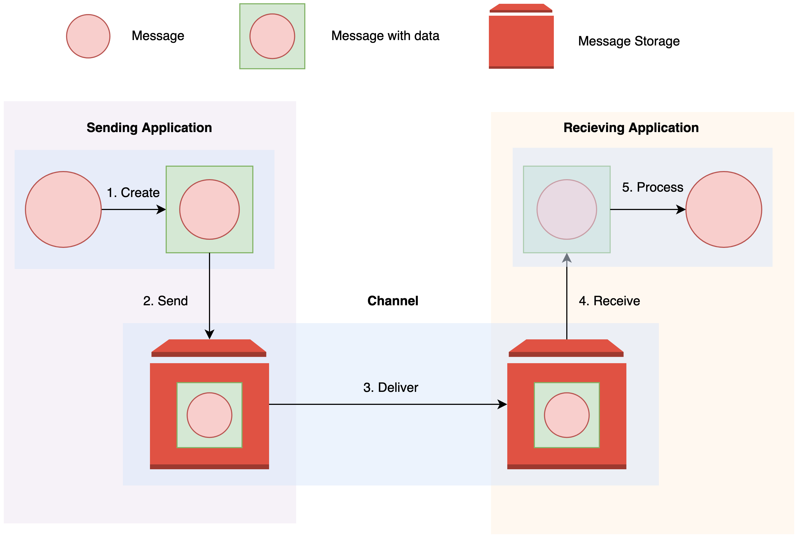

# Introduction

## Challenges of integration solutions

1. Netwroks are unreliable
2. Netwroks are slow
3. Any two applications are different
4. Chagnes are inevitable

## Approcahes of solving enterprise integration

1. File Transfer
2. Shared Database
3. Remote Procedure Invocation
4. Messaging

## Message Transmission step by step

Note:

There are 5 steps involved in transmission of message:

1. __Create__: The sender created the message and populates it with data.
2. __Send__: The sender adds themessage to channel.
3. __Deliver__: The messaging system moves the message from sender's computer to revciever's computer.
4. __Recieve__: The reciever reads the message from the channel.
5. __Process__: The reciever extracts the data from the message.

There are two different strategies involved when sending data to a channel:

1. __Send and Forget__: The sender sends the message but does not wait for reciever to reply.
2. __Store and Forward__: The sender stores a copy of sent message and it can retry to send message if the reciever does not sends a confirmation. This approach is also known as ___Outbox Pattern___.

## Why use messaging?

- _More immediate_ than __file transfer__.
- _Better encapsulated_ than __shared database__.
- _More reliable_ than __Remote procedure Invocation__.
- _Remote Communication_: It allows two remote services to communicate and share data.
- _Platform and Language Integration_: Allows us to integrate systems on different languages and platforms.
- _Asynchronous Communication_: Allows send and forget approach.
- _Variable Timing_: Both reciever and sender can work at different times.
- _Throttling_: Reciever can control the rate at which it consumes the messages.
- _Reliable Communcication_: It is possible to carry out store and forward approach "_guaranteeing_" the delivery of messages.
- _Disconnected Operation_: Allows delivery of messages to disconnected systems when they are available to sync.
- _Meditation_: The messaging system acts as a mediator between many systems.
- _Thread Management_: Aysnchronous messaging allows one application to work without blocking anotherone.

## Challenges of Messaging

- _Complex programming model_: We need to use event driven programming model.
- _Sequence Issues_: The sequence of messgaes is not guaranteed by default. Some extra steps need to be taken for ensuring this.
- _Synchronous scenarios_: There may be scenarios where synchronous communication is needed e.g. to check the price of airlines ticket. Messaging system is not suitable for such situations.
- _Performance_: Messaging system add some overhead to the communication.
- _Vendor Lock in_: Once you select a system you get vendor locked in as every vendor has a different messgae format.
